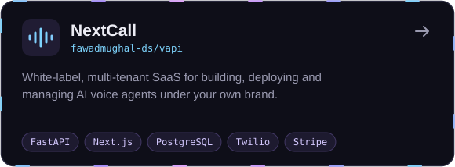
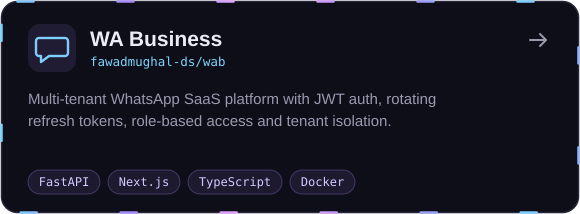
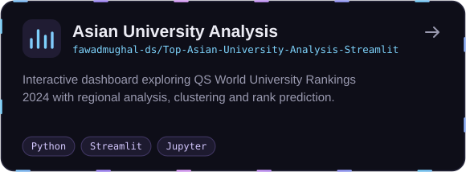
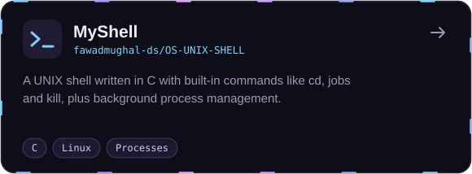

  

  
  
  

  <a href="#-about-me"><b>About</b></a> &nbsp;·&nbsp;
  <a href="#-featured-projects"><b>Projects</b></a> &nbsp;·&nbsp;
  <a href="#-toolbox"><b>Toolbox</b></a> &nbsp;·&nbsp;
  <a href="#-github-activity"><b>Activity</b></a> &nbsp;·&nbsp;
  <a href="#-lets-work-together"><b>Contact</b></a>

## 👋 About me

  

<b>Prefer plain text?</b>

 

- 🔭 Freelancing in **web development**, shipping full-stack products end to end
- 🤖 Building **AI voice agents**, **WhatsApp SaaS** and **RAG pipelines**
- 🌱 Growing my skills in **data science** and **machine learning**
- ⚡ Off the keyboard: exploring new tech and reading up on the latest in AI
- 📫 Reach me at **[help.fawadmughal@gmail.com](mailto:help.fawadmughal@gmail.com)**

## 🚀 Featured projects

  
  
  
  

<b>More repositories</b>

 

| Repository | What it is | Main language |
| :-- | :-- | :-- |
| [cattle-monitoring](https://github.com/fawadmughal-ds/cattle-monitoring) | Cattle monitoring dashboard | TypeScript |
| [CraftAFloor-local](https://github.com/fawadmughal-ds/CraftAFloor-local) | Python backend with a TypeScript front end | Python |
| [Intro-to-Data-Science](https://github.com/fawadmughal-ds/Intro-to-Data-Science) | Data science coursework notebooks | Jupyter Notebook |
| [DSA](https://github.com/fawadmughal-ds/DSA) | Data structures and algorithms practice | Python |
| [Python-Games](https://github.com/fawadmughal-ds/Python-Games) | Small games written in Python | Python |
| [Python](https://github.com/fawadmughal-ds/Python) | OOP exercises and assorted Python programs | Python |

<a href="https://github.com/fawadmughal-ds?tab=repositories">Browse all repositories →</a>

## 🧰 Toolbox

<table>
  <tr>
    <td width="170"><b>Languages</b></td>
    <td></td>
  </tr>
  <tr>
    <td><b>Web &amp; APIs</b></td>
    <td></td>
  </tr>
  <tr>
    <td><b>Data &amp; ML</b></td>
    <td>
       
      plus Pandas · Seaborn · Streamlit · Jupyter · Selenium
    </td>
  </tr>
  <tr>
    <td><b>Databases</b></td>
    <td>
       
      plus Oracle
    </td>
  </tr>
  <tr>
    <td><b>Tooling</b></td>
    <td></td>
  </tr>
  <tr>
    <td><b>Design</b></td>
    <td></td>
  </tr>
</table>

## 📈 GitHub activity

  
  

  <picture>
    <source media="(prefers-color-scheme: dark)" srcset="https://raw.githubusercontent.com/fawadmughal-ds/fawadmughal-ds/output/snake-dark.svg" />
    <source media="(prefers-color-scheme: light)" srcset="https://raw.githubusercontent.com/fawadmughal-ds/fawadmughal-ds/output/snake.svg" />
    
  </picture>

## 🤝 Let's work together

I'm open to freelance projects and collaborations in **web development**, **AI products** and **data science**. The fastest way to reach me is email.

  
  

  

<a href="#top">Back to top ↑</a>

